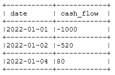
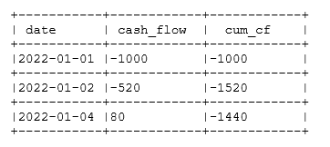

## Задание 1.2:

## изначальный вид таблицы



### Нужно написать запрос, чтобы получить нарастающий итог для денежного потока каждый день таким образом, чтобы в конечном итоге получилась таблица в такой форме:


для реализации этого запроса можно использовать несколько методов - добавить вложенный подзапрос или использовать self join. 

однако эффективнее всего будет использовать оконную функцию sum + over

```sql
SELECT
    date,
    cash_flow,
    SUM(cash_flow) OVER (ORDER BY date) AS cum_cashflow
FROM
    transactions
ORDER BY
    date;
```